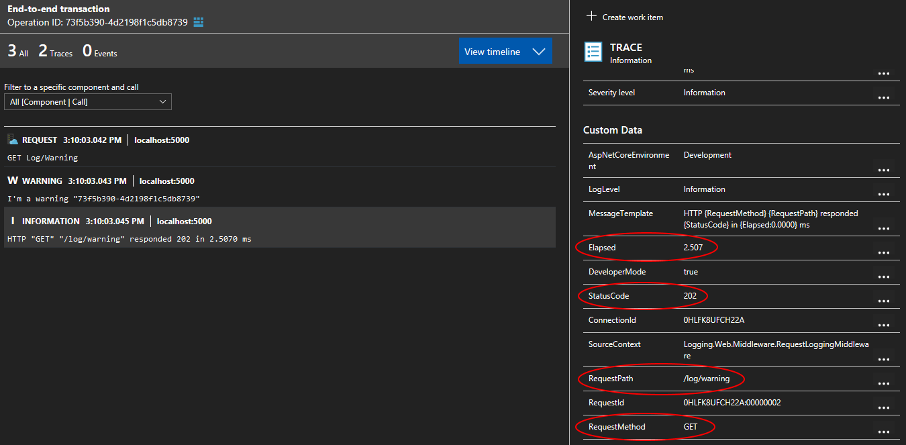
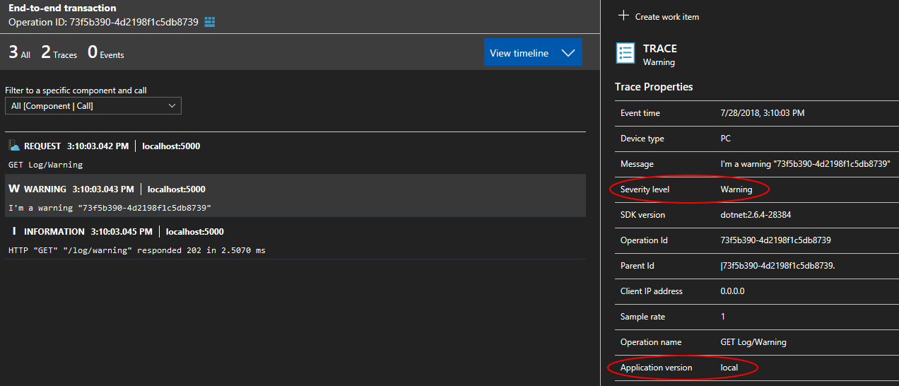
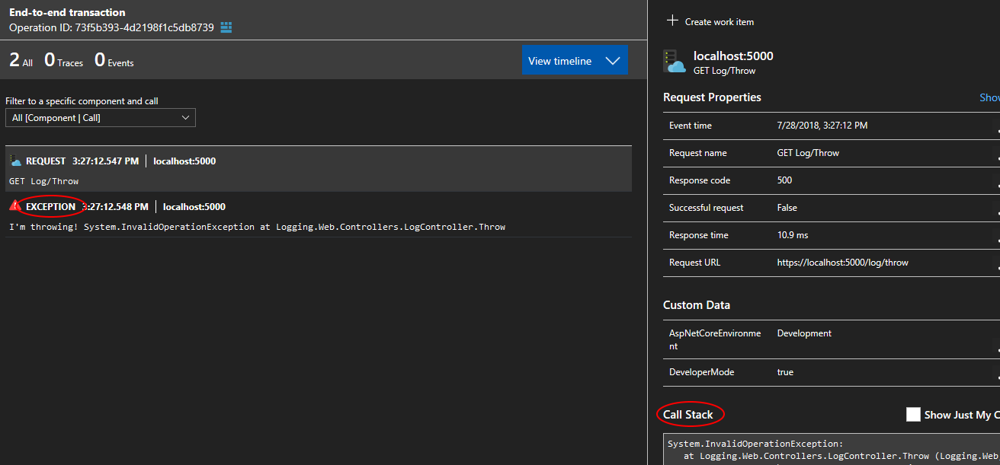

# ASP.NET Core 2.1 + Serilog + Application Insights

- Logging should be wired up as early as possible to capture startup issues
- Use `Microsoft.Extensions.Logging.ILogger<T>` instead of `Serilog.ILogger`

## Application Insights instrumentation key

The Application Insights instrumentation key should be stored as a secret. When running locally you can leverage the [Secret Manager][secret-manager].

Navigate to `src/Logging.Web/` and type:

```posh
dotnet user-secrets set ApplicationInsights:InstrumentationKey <instrumentation-key>
```

**Beware**: Application Insights instrumentation key cannot be rotated.

## Application Insights configuration

**Note**: this is based on the `NuGet` package [Microsoft.ApplicationInsights.AspNetCore][ai-nuget] `2.3.0`.

Some settings can be set via [ASP.NET Core configuration][aspnet-core-configuration] and code while others can only be set via code. If known configuration keys are set they will take precedence over the "normal" configuration keys.

| Code property name | Known configuration key | "Normal" configuration key |
| - | - | - |
| `AddAutoCollectedMetricExtractor` | N/A | N/A |
| `ApplicationVersion` | `version` | N/A |
| `DeveloperMode` | `APPINSIGHTS_DEVELOPER_MODE` | `ApplicationInsights:TelemetryChannel:DeveloperMode` |
| `EnableAdaptiveSampling` | N/A | N/A |
| `EnableAuthenticationTrackingJavaScript` | N/A | N/A |
| `EnableDebugLogger` | N/A | N/A |
| `EnableHeartbeat` | N/A | N/A |
| `EnableQuickPulseMetricStream` | N/A | N/A |
| `EndpointAddress` | `APPINSIGHTS_ENDPOINTADDRESS` | `ApplicationInsights:TelemetryChannel:EndpointAddress` |
| `InstrumentationKey` | `APPINSIGHTS_INSTRUMENTATIONKEY` | `ApplicationInsights:InstrumentationKey` |

### Most relevant settings

- `ApplicationVersion` will appear as `Application Version` in the Application Insights portal
  - Defaults to the value of the [entry assembly][entry-assembly]'s [VersionAttribute][version-attribute]  which has some fairly restrictive [rules][version-attribute-rules]
  - Even more relevant if you leverage [canary releases][canary-release] as you'll have two different versions of your application serving production traffic
- `DeveloperMode` will send data immediately, one telemetry item at a time. This reduces the amount of time between the moment when your application tracks telemetry and when it appears on the Application Insights portal
  - If a debugger is attached on process startup, the `SDK` will ignore the configuration keys related to `DeveloperMode` and turn it on
- `EnableAdaptiveSampling` affects the volume of telemetry sent from your web server app to the Application Insights service endpoint. The volume is adjusted automatically to keep within a specified maximum rate of traffic ([documentation][adaptive-sampling]).
- `InstrumentationKey` self-explanatory

### A better way to configure Application Insights

The [most relevant settings](#most-relevant-settings) require to be configured via configuration **and** code. The process is cumbersome as:

- if using the configuration ([SDK source][configuration-via-configuration]), only some settings can be set; Namely: `ApplicationVersion`, `DeveloperMode`, `EndpointAddress` and `InstrumentationKey` ([SDK source][configuration-via-configuration-settings]). The notable absent here is `EnableAdaptiveSampling`.
- if using the code ([SDK source][configuration-via-code]), the `SDK` will instantiate its own `IConfiguration` ([SDK source][configuration-via-code-default]) using three providers: `appsettings.json`, `appsettings.{EnvironmentName}.json` and `environment variables`. If you're leveraging any other providers such as the Secret Manager, Key Vault or the command line they will be ignored. This will impact `InstrumentationKey` as it should be stored as a secret.

I wrote an [extension method](src/Logging.Web/Extensions/ServiceCollectionExtensions.cs) that leverages both and allow you to set the most relevant settings via configuration.

## Request logging middleware

I disabled the built-in request logging by setting the `Microsoft` minimum level to `Warning` and replaced it by `RequestLoggingMiddleware`.

- Emit a single `Information` event when the request completes instead of two (one at the beginning and one at the end)
- Requests that throw an `Exception` or return a HTTP status code greater than `499` are logged as `Error`
  - Swallow the `Exception` to avoid duplicate logging of `Exception`

## Results in Application Insights portal

### Request middleware

Notice how request properties such as the `RequestMethod` and `StatusCode` are recorded as `Custom Data`. This gives us the ability to query them in `Application Insights` and `Log Analytics`.



### Warning event

Log events emitted by `Serilog` are recorded as `Traces` by `Application Insights`. The `Severity level` of `Warning` has been preserved. The value (`local`) of the `Application version` has been read from configuration using an [extension method](#a-better-way-to-configure-application-insights).



### Exception

`Error` log events emitted along with an `Exception` will be recorded as `Exception` by `Application Insights`. The `Request` recorded by `Application Insights` will have knowdledge of the `Exception` and expose the stacktrace.



[ai-nuget]: https://www.nuget.org/packages/Microsoft.ApplicationInsights.AspNetCore/2.3.0
[aspnet-core-configuration]: https://docs.microsoft.com/en-us/aspnet/core/fundamentals/configuration/?view=aspnetcore-2.1&tabs=basicconfiguration
[secret-manager]: https://docs.microsoft.com/en-us/aspnet/core/security/app-secrets?view=aspnetcore-2.1&tabs=windows#secret-manager
[version-attribute]: https://docs.microsoft.com/en-us/dotnet/api/system.reflection.assemblyversionattribute?view=netcore-2.1
[entry-assembly]: https://docs.microsoft.com/en-us/dotnet/api/system.reflection.assembly.getentryassembly?view=netcore-2.1#System_Reflection_Assembly_GetEntryAssembly
[version-attribute-rules]: https://docs.microsoft.com/en-us/dotnet/api/system.reflection.assemblyversionattribute?view=netcore-2.1#remarks
[canary-release]: https://martinfowler.com/bliki/CanaryRelease.html
[adaptive-sampling]: https://docs.microsoft.com/en-us/azure/application-insights/app-insights-sampling#adaptive-sampling-at-your-web-server
[configuration-via-configuration]: https://github.com/Microsoft/ApplicationInsights-aspnetcore/blob/6e602f85b1d39d9e779f001297def36b1e935899/src/Microsoft.ApplicationInsights.AspNetCore/Extensions/ApplicationInsightsExtensions.cs#L77
[configuration-via-configuration-settings]: https://github.com/Microsoft/ApplicationInsights-aspnetcore/blob/6e602f85b1d39d9e779f001297def36b1e935899/src/Microsoft.ApplicationInsights.AspNetCore/Extensions/ApplicationInsightsExtensions.cs#L314
[configuration-via-code]: https://github.com/Microsoft/ApplicationInsights-aspnetcore/blob/6e602f85b1d39d9e779f001297def36b1e935899/src/Microsoft.ApplicationInsights.AspNetCore/Extensions/ApplicationInsightsExtensions.cs#L91
[configuration-via-code-default]: https://github.com/Microsoft/ApplicationInsights-aspnetcore/blob/6e602f85b1d39d9e779f001297def36b1e935899/src/Microsoft.ApplicationInsights.AspNetCore/Extensions/DefaultApplicationInsightsServiceConfigureOptions.cs#L30